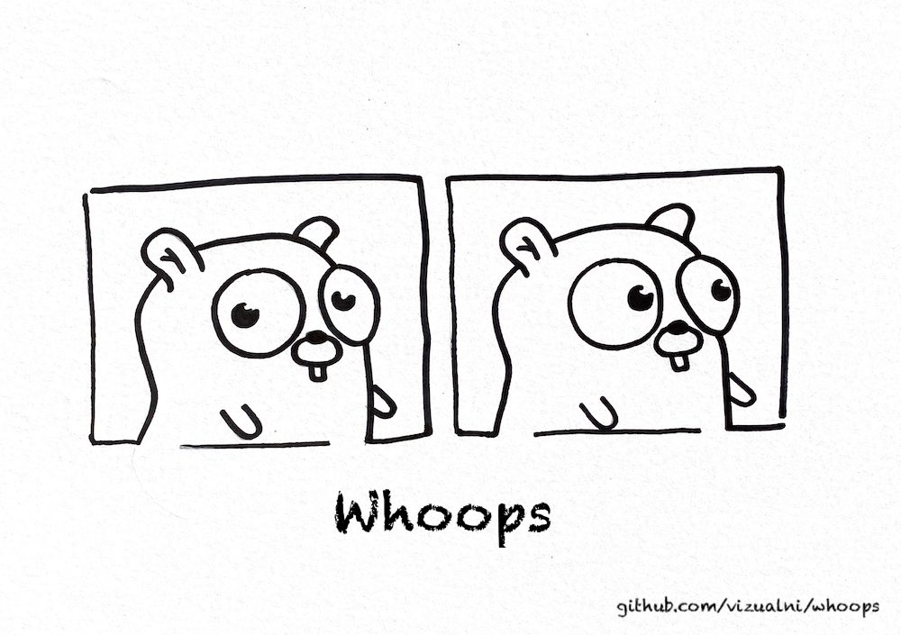

# Whoops!



-----

Whoops is a small helper Go library to help you with errors in Go. I've decided to create this library because I've noticed that I am using basically the same pattern
all over and I wanted to make a library to help me save some time.


# Error types

The thing that I wanted to avoid was creating package level errors as `vars`. I want to define those as a `const` to ensure that there is no way that somebody is going
to accidently change it. Thus, most of the errors in whoops package can be created as consts.

## String

```go
import "github.com/vizualni/whoops"
const ErrTheAfwulThingHasHappened = whoops.String("something bad has happened")
```

## Errorf

```go
import "github.com/vizualni/whoops"
const ErrPayloadSizeTooLarge = whoops.Errorf("payload size too large. got %d bytes")

// ...

return ErrPayloadSizeTooLarge.Format(len(payload))


// later in code you can do

var err error

if whoops.Is(err, ErrPayloadSizeTooLarge) {
	// do your thing
}
```


## Wrap errors with custom fields

```go
import "yourpackage"
import "github.com/vizualni/whoops"

const ErrFieldUser[yourpackage.User] = "user"
const ErrFieldQuery[yourpackage.Query] = "query"

func process() error {
	var (
		err error
		user yourpackage.User
		query yourpackage.Query
	)
	// ...
	return whoops.Wrap(err, ErrFieldUser.Val(user), ErrFieldQuery.Val(query))
}

// not the best example, but you get the picture
func caller() {
	err := process()
	if err != nil {
		var (
			query yourpackage.Query
			ok bool
		)
		if query, ok = ErrFieldQuery.GetFrom(err); ok {
			log.Error("error %s with query: %s", err, query.YourMethodThatReturnsQueryThatWasUsed())	
			// ...
		}
	}
	// ...
}

return ErrPayloadSizeTooLarge.Format(len(payload))
```

